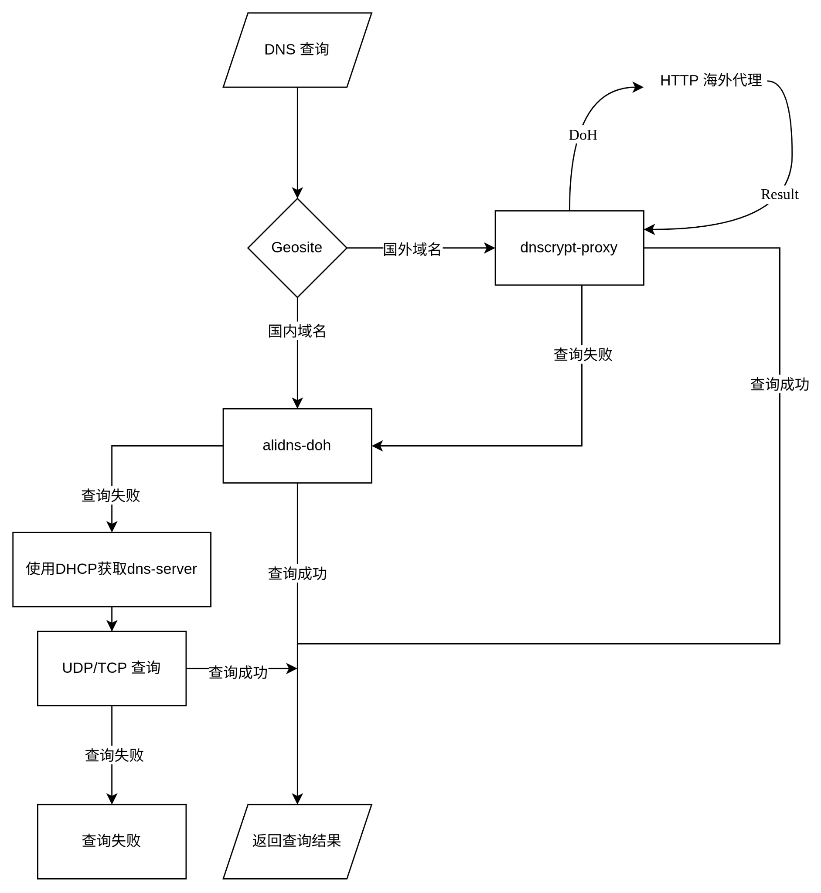

# RugDNS

## 大致设计

难点：我使用代理去做 DoH，但是，我并不知道代理是否可用，确切说是不知道代理是否已经完成了其内部代理节点的 DNS 解析，因为我们假设代理节点域名的 DNS 解析请求也被发送到了 rugdns 服务，目前的方案是设置超时，若超时视为不可用，则回滚到 DNScrypt 协议，再不可用回滚到不使用代理的 DoH 协议，再不可用回滚到普通的 DNS 协议，再不可用则使用 DHCP 分配的服务器。

另一个方案是，将代理订阅链接交给 rugdns，或者将配置文件的路径交给 rugdns，这样，rugdns 自动去检查配置中的代理节点的域名，直接转到 DNScrypt 或 DoH.

我想还需要维护一个表，如果用代理解析出来的都在国内，就把这个域名放在国内的 site 里面，这个表最好是运行时的，然后其优先级低于用户设置的规则.

或许可以再多一层，提前用一个已经解析出来 IP 的 DoH 去获取 DoH 的域名，但是 DNS Stamp 里面好像都有吧？



- 我在想那个 DNSSEC 如果 verify 不通过的话，能不能映射到我们自己的 ip 上，然后这个是一个本地 Web 服务，只有用户允许，才会返回真正的 DNS

我的所有 resolver 都根据是否 DNSSEC 分成两个列表（DHCP 除外），根据用户发送的查询
- 如果有 `DO` Flag，那只运行 DNSSEC 的（除非没有 DNSSEC resolver，我就只能强征一个不支持 DNSSEC 的了），挑选 ?? 个来运行，然后不停运行直到超时或收到一个可以返回的响应。
- 如果**没有**设置 `DO` Flag，那就两个列表各自选 ?? 个来运行。如果任何一个resolver返回非正常响应，都换一个，直到超时。如果其中有一个正常响应，那就直接用这个结果返回，如果这个结果没有经过验证或验证失败，直接设置 AD 为 0 即可.

## DNS Header Flags and EDNS Header Flags

**Reference**: [RFC 1035](https://datatracker.ietf.org/doc/html/rfc1035/#autoid-41), [iana-DNS-Params](https://www.iana.org/assignments/dns-parameters)

```text
                                 1  1  1  1  1  1
      0  1  2  3  4  5  6  7  8  9  0  1  2  3  4  5
    +--+--+--+--+--+--+--+--+--+--+--+--+--+--+--+--+
    |                      ID                       |
    +--+--+--+--+--+--+--+--+--+--+--+--+--+--+--+--+
    |QR|   Opcode  |AA|TC|RD|RA|Z |AD|CD|   RCODE   |
    +--+--+--+--+--+--+--+--+--+--+--+--+--+--+--+--+
```

- `QR`: `0`: 这是一条 *Query*；`1`: 这是一条 *Response*.
- `OPCODE`: 操作码

    | OpCode | Name                    |
    |--------|-------------------------|
    | 0      | Query                   |
    | 1      | Inverse Query           |
    | 2      | Status                  |
    | 3      | Unassigned              |
    | 4      | Notify                  |
    | 5      | Update                  |
    | 6      | Dns Stateful Operations |
    | 7-15   | Unassigned              |

- `AA`: Authoritative Answer，权威回答
  - Query: 没有有效语义，通常应为 0.
  - Response: `1` 表示响应服务器对于 Question 对应的名字是权威服务器. 不太严谨的解释就是回答是由权威服务器直接返回的.
- `TC`: Truncated Response，被截断的响应
  - Query: 正常查询通常为 0.
  - Response: `1` 表示由于传输大小限制，必须返回的数据没能完整装入响应。客户端通常应换更合适的传输方式重新查询，例如 TCP。
- `RD`：Recursion Desired，需要进行递归解析
  - Query: `1` 表示“希望服务器替我递归解析”；`0` 表示不要求递归.
  - Response: 服务端会把 Query 中的 `RD` **原样复制**回来，**不代表**真的进行了递归查询
- `RA`：Recursion Available，可以进行递归解析
  - Query: 没有请求语义，一般为 `0`.
  - Response: `1` 表示响应方提供递归解析**能力**；`0` 表示不提供.
- `AD`: Authentic Data，已验证的数据
  - Query: 无意义，一般为 `0`.
  - Response: `0` 表示响应方认为相关 Answer，以及相关 negative-answer Authority 数据已经通过 DNSSEC authentication.
- `CD`: Checking Disabled，请求 resolver 禁用 DNSSEC checking
  - Query: `1` 表示客户端要求 validating resolver 不要因为 DNSSEC validation failure 而阻止数据返回；客户端可能打算自己验证。`0` 表示正常让 resolver 执行 DNSSEC validation。
  - Response: 把 Query 中的 `CD` bit 复制到 Response.
- `DO` (EDNS): DNSSEC answer OK
  - Query: `1` 表示“我能够接收 DNSSEC security RRs”，`0` 时服务器不会附加相关字段供验证.
  - Response: 服务器必须把 Query 中的 `DO` 值复制到 Response.
- `CO` (EDNS): Compact Answers OK
  - Query: `1` 表示 requester 支持 RFC 9824 定义的 Compact Answers / Compact Denial of Existence，允许服务器针对不存在的数据使用这种更紧凑的 DNSSEC 响应形式。
  - Response: 用于协商/表示对应 Compact Answers 能力；具体行为遵循 RFC 9824
- `DE` (EDNS): Delegation Extensions
  - 不稳定，本项目暂时忽略.

## DNS RCODEs

[iana](https://www.iana.org/assignments/dns-parameters#dns-parameters-6)

## Issues

配置错误或不提供 DNSSEC 功能的服务器会导致 DNSSEC Client 发生不正常的解析行为：

[fanyi.baidu.com.](https://dnsviz.net/d/fanyi.baidu.com/dnssec/)
[dnssec-failed.org.](https://dnsviz.net/d/dnssec-failed.org/dnssec/)
[luogu.com.cn](https://dnsviz.net/d/luogu.com.cn/dnssec/)

## Plan

>[!NOTE]
> Add corresponding test.

- [ ] (Resolver) Re-establish HTTP2 connection.
- [ ] (Handler/Resolver) 
- [ ] (Handler/Resolver) Timeout machanism.
- [ ] (Resolver) Support udp, tcp, DNScrypt(with/without proxy) and https(with/without proxy).
- [ ] (Resolver) Customed resolvers.
- [ ] (Resolver) Selection and Fallback machanism.
- [ ] (Handler) Handle resolver error.
- [ ] (Handler) DNS Cache.

## Resources

- DNSViz - visual chain and validation diagnostics: https://dnsviz.net/
- Verisign DNSSEC resources and analyzers: https://www.verisign.com/news-insights/dnssec/
- DNS-OARC - operational community, tools and measurement: https://www.dns-oarc.net/
- IANA DNSSEC pages with root key material and ceremony archives: https://www.iana.org/dnssec
- Internet Society Deploy360 pages on DNSSEC basics and tools: https://www.internetsociety.org/deploy360/dnssec/
- Test Tool - test whether you are protected by DNSSEC: http://www.dnssec-or-not.com/

## Project status

RugDNS is currently in heavy development, expect breaking changes.

## License

RugDNS is MIT-licensed. For more information check the [LICENSE](./LICENSE) file.
